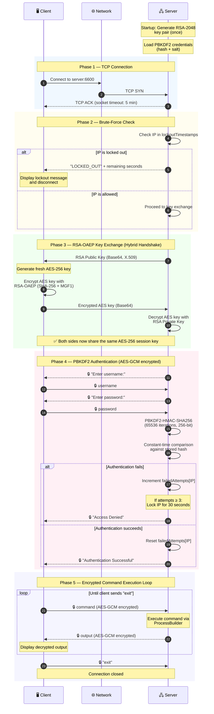
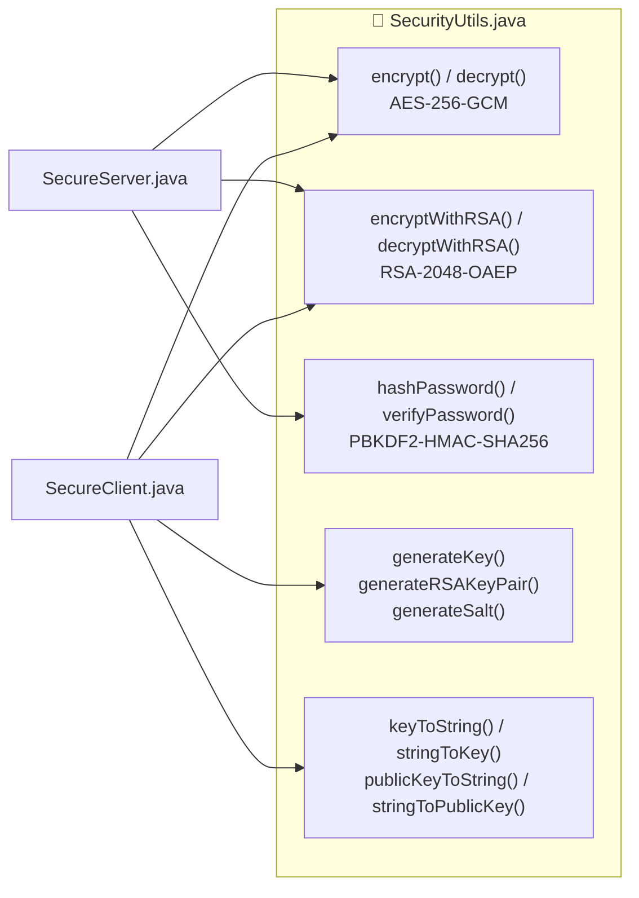

# 📖 Secure Remote Access Tool — Documentation

> A friendly guide to understanding how this project works.
> No deep crypto knowledge needed — we explain everything with real-world analogies.

---

## What Is This Project?

Imagine you want to control a computer that's in another room (or another country). You'd need a way to:

1. **Connect** to it over the network
2. **Prove who you are** (so strangers can't get in)
3. **Send commands** and get results back
4. **Keep everything private** so nobody can eavesdrop

That's exactly what this tool does — it's like a **secure walkie-talkie for computers**. You type a command on your machine (the **Client**), it gets encrypted, sent over the network, executed on the remote machine (the **Server**), and the result comes back to you — all fully encrypted.

> **Think of it like this:** Instead of shouting across a room where everyone can hear (regular telnet), you're passing encrypted notes in sealed envelopes that only you and the server can open.

---

## How Does a Connection Work? (The Big Picture)

Every time a client connects to the server, the connection goes through **5 phases** — like 5 checkpoints. Each one must pass before moving to the next.

Here's the full flow as a diagram:



Now let's walk through each phase in plain language.

---

## Phase 1 — Connecting (The Handshake)

> 🏠 **Analogy:** You walk up to a building and ring the doorbell. The building acknowledges you're there.

**What happens:**
- The **Server** is running and listening on port `6600`, like a receptionist waiting for visitors.
- The **Client** sends a connection request over the network (a TCP "SYN").
- The **Server** accepts and responds (TCP "ACK") — the connection is now open.
- A **5-minute timer** starts. If nobody talks for 5 minutes, the connection auto-closes (so abandoned connections don't pile up).
- The server creates a **separate thread** for this client, meaning other clients can connect at the same time without waiting.

**What can go wrong:**
- 🚫 Server isn't running → "Connection Refused"
- 🚫 Firewall blocking port 6600 → Connection times out
- 🚫 Wrong IP address → Can't reach the server

---

## Phase 2 — Are You Blocked? (The Bouncer Check)

> 🚪 **Analogy:** Before you even get to show your ID, the bouncer checks a list. If you've been causing trouble (too many wrong passwords), you're turned away at the door.

**What happens:**
- The server looks up the client's IP address in a "trouble list."
- If this IP has **failed 3 login attempts recently**, it's temporarily locked out for **30 seconds**.
- A locked-out client gets a `"LOCKED_OUT"` message and the connection closes immediately — no key exchange, no authentication, nothing.
- If the IP is clean, the connection moves forward.

**Why this matters:**

Without this check, an attacker could try thousands of passwords every second. The lockout slows them down dramatically:

| Without Protection | With Protection |
|---|---|
| Try unlimited passwords per second | Only 3 tries, then wait 30 seconds |
| Could crack weak passwords in minutes | Would take days/weeks even for simple passwords |

---

## Phase 3 — Exchanging the Secret Code (The Key Exchange)

> 🔐 **Analogy:** Imagine you want to pass secret notes with someone, but you've never met them before. You need a way to agree on a secret code *without anyone overhearing it*. Here's how:
>
> 1. The server sends you an **open padlock** (RSA public key) — anyone can see it, that's fine.
> 2. You put your secret code (AES key) inside a box, lock it with that padlock, and send it back.
> 3. Only the server has the **key to the padlock** (RSA private key), so only they can open the box and get the secret code.
> 4. Now you both know the secret code, and nobody who was watching can figure it out!

**What actually happens (technically):**

1. **Server → Client:** Sends its RSA public key (safe to send openly — it can only *encrypt*, not decrypt).
2. **Client creates an AES-256 key** — this will be the "secret code" used for all future messages. A fresh key is created for *every* connection, so compromising one session doesn't affect others.
3. **Client → Server:** Encrypts the AES key using the server's RSA public key (with OAEP padding for extra security) and sends it.
4. **Server decrypts** the AES key using its private key.
5. ✅ Both sides now have the same AES-256 key. Everything from here on is encrypted.

**Why two types of encryption?**
- **RSA** (asymmetric) is like a mailbox — anyone can drop mail in, but only the owner can open it. It's secure but *slow* and can only handle small data.
- **AES** (symmetric) is like a shared padlock combination — fast and can encrypt huge amounts of data. But you need a way to share the combination first.
- The **hybrid approach** uses RSA once (to safely share the AES key), then uses fast AES for everything else. Best of both worlds!

---

## Phase 4 — Proving Your Identity (Authentication)

> 🪪 **Analogy:** You're inside the building now, but you need to show your ID at the front desk before they let you use anything.

**What happens:**
1. The server asks for your **username** and **password** (these prompts are already encrypted with AES).
2. You type them in, and they're **encrypted before leaving your machine** — your password never travels in plain text.
3. The server receives the encrypted credentials, decrypts them, and checks:
   - Does the username match? ✅
   - Does the password match the stored hash? ✅

**How passwords are stored (safely!):**

The server **never stores your actual password**. Instead, it stores a scrambled version called a **hash**:

```
"secure123"  →  PBKDF2 (65,536 rounds of scrambling)  →  "5nqJWqZVF9cXpMs+F7zN1..."
```

When you log in, the server scrambles what you typed and compares the two scrambled versions. If they match, you're in!

> 🧂 **What's a "salt"?** A random value mixed in before scrambling. Even if two users have the same password, their hashes will be completely different because their salts are different. This defeats attackers who pre-compute hash tables (rainbow tables).

**If you get it wrong:**
- Each failed attempt is counted per IP address.
- After **3 failures** → your IP is locked out for **30 seconds** (goes back to Phase 2 bouncer check).
- A successful login **resets the counter** — clean slate.

---

## Phase 5 — Running Commands (The Fun Part!)

> 💻 **Analogy:** You're now logged in and sitting at a virtual terminal. Type commands, get results — just like you're sitting in front of the remote computer.

**What happens:**
1. You see a prompt like: `admin@remote-server:~$`
2. You type a command (e.g., `dir`, `ls`, `whoami`).
3. Your command gets **encrypted** → sent to the server → **decrypted** → **executed**.
4. The server captures the output → **encrypts it** → sends it back → you **decrypt and see the result**.
5. This loop continues until you type `exit`.

**Special handling for `cd` (change directory):**

Since each command runs in a fresh shell process, `cd` normally wouldn't "stick" between commands. The server handles this smartly:
- `cd` commands update an internal path tracker instead of actually running `cd` in a shell.
- The next command you run will execute in the new directory.
- Chained commands like `cd .. && dir` work too — the server splits them, does the `cd`, then runs `dir` in the new location.

**What the server logs:**
For security, the server **never logs what you typed**. It only logs:
```
Received command from 192.168.1.5 (6 chars)
```
This prevents sensitive data (like passwords typed in commands) from leaking into log files.

---

## The Crypto Building Blocks (Visual Overview)

Here's how all the cryptographic pieces fit together:

```mermaid
graph TB
    subgraph CRYPTO["🔐 Cryptographic Architecture"]
        direction TB

        subgraph AES["AES-256-GCM (Symmetric)"]
            A1["Algorithm: AES/GCM/NoPadding"]
            A2["Key Size: 256-bit"]
            A3["IV: 12 bytes (random per message)"]
            A4["Auth Tag: 128-bit"]
            A5["Wire Format: Base64(IV ∥ ciphertext ∥ tag)"]
            A1 --- A2 --- A3 --- A4 --- A5
        end

        subgraph RSA["RSA-2048-OAEP (Asymmetric)"]
            R1["Algorithm: RSA/ECB/OAEPWithSHA-256AndMGF1Padding"]
            R2["Key Size: 2048-bit"]
            R3["Purpose: Secure AES key exchange"]
            R4["Padding: OAEP (prevents Bleichenbacher attack)"]
            R1 --- R2 --- R3 --- R4
        end

        subgraph PBKDF2["PBKDF2 (Password Hashing)"]
            P1["Algorithm: PBKDF2WithHmacSHA256"]
            P2["Iterations: 65,536"]
            P3["Output: 256-bit hash"]
            P4["Salt: 128-bit (unique per user)"]
            P5["Comparison: Constant-time XOR"]
            P1 --- P2 --- P3 --- P4 --- P5
        end

        subgraph BRUTE["🛡️ Brute-Force Protection"]
            B1["Max Attempts: 3 per IP"]
            B2["Lockout Duration: 30 seconds"]
            B3["Storage: ConcurrentHashMap"]
            B1 --- B2 --- B3
        end
    end

    subgraph FLOW["📡 Data Flow"]
        direction LR
        F1["Server generates<br/>RSA key pair"] --> F2["Client receives<br/>RSA public key"]
        F2 --> F3["Client generates<br/>AES-256 key"]
        F3 --> F4["Client encrypts AES key<br/>with RSA-OAEP"]
        F4 --> F5["Server decrypts with<br/>RSA private key"]
        F5 --> F6["All further messages<br/>encrypted with AES-GCM"]
    end

    RSA -->|"Secures"| FLOW
    AES -->|"Encrypts all traffic"| FLOW
    PBKDF2 -->|"Authenticates user"| FLOW
    BRUTE -->|"Rate-limits login"| FLOW
```



---

## Why These Technologies?

Here's a simple breakdown of every technology we chose and *why* — explained without jargon.

### ☕ Java — The Language

| Question | Answer |
|----------|--------|
| **Why Java?** | Java comes with built-in encryption and networking libraries. We didn't need to install anything extra — everything (AES, RSA, PBKDF2, sockets, threads) is included out of the box. |
| **Why not Python/Node.js?** | Java's security libraries are battle-tested and certified. Plus, the same code runs on Windows, macOS, and Linux without changes. |

### 🌐 TCP Sockets — The Connection

| Question | Answer |
|----------|--------|
| **What are sockets?** | Think of them as phone lines between two computers. One side "calls," the other "picks up," and they can talk back and forth. |
| **Why TCP?** | TCP guarantees messages arrive in order and without missing pieces. This is critical because our 5-phase handshake is sequential — if messages arrived out of order, the whole thing would break. |
| **Why not use HTTPS/TLS?** | We *could* — and in production, you *should*. But the goal of this project is to understand encryption from scratch by building it ourselves. Using TLS would hide all the interesting stuff! |

### 🔒 AES-256-GCM — Encrypting Messages

| Question | Answer |
|----------|--------|
| **What is AES?** | The worldwide standard for encryption. Banks, governments, and messaging apps all use it. |
| **Why 256-bit?** | Bigger key = harder to guess. AES-256 has so many possible keys that trying all of them would take longer than the age of the universe — even with every computer on Earth working together. |
| **What does GCM add?** | GCM adds a "tamper seal" to every message. If someone intercepts and modifies even a single character, the receiver will know and reject it. Without GCM (like the old ECB mode), an attacker could modify messages silently. |
| **Why not ECB mode?** | ECB encrypts each block independently, so identical data produces identical encrypted output. This leaks patterns. Imagine encrypting an image with ECB — you can still see the outline! GCM doesn't have this problem. |

### 🔑 RSA-2048-OAEP — The Key Exchange

| Question | Answer |
|----------|--------|
| **What's the problem RSA solves?** | AES needs both sides to have the same secret key. But how do you share a secret key over an unsafe network? RSA solves this: the server sends a "public lock," the client locks the secret key inside, and only the server can unlock it. |
| **Why 2048-bit?** | RSA-2048 would take an impossibly long time to crack with current technology. It gives ~112 bits of security strength. |
| **What's OAEP?** | A modern padding method that adds randomness before encryption. Without it, an attacker could slowly figure out your message by sending carefully crafted fakes to the server (Bleichenbacher's attack from 1998). OAEP prevents this. |

### 🧂 PBKDF2 — Password Protection

| Question | Answer |
|----------|--------|
| **Why not just store the password?** | If someone sees the code or database, they'd see every password instantly. By storing only a scrambled hash, even a leak doesn't reveal the actual password. |
| **Why scramble 65,536 times?** | Normal hashing is fast — an attacker can try billions of passwords per second. By repeating the hash 65,536 times, each guess takes much longer, slowing attackers from billions/sec to thousands/sec. |
| **What's the salt for?** | Without salt, two users with the same password would have the same hash. An attacker could pre-compute hashes for common passwords (rainbow tables). Salt makes each hash unique, defeating this. |

### 🧵 Multi-threading — Handling Multiple Users

| Question | Answer |
|----------|--------|
| **How?** | Each client connection runs in its own thread — like having a separate receptionist for each visitor. They work independently and don't interfere with each other. |
| **Why is this important?** | Without threads, the server could only handle one client at a time. Everyone else would have to wait in line! |

---

## Project Files — What Does Each File Do?

```
📁 secure_remote_access_tool/
│
├── 📁 com/remote/                     ← The main application code
│   ├── 🔐 SecurityUtils.java          ← All encryption/decryption logic lives here
│   ├── 🖧  SecureServer.java           ← The server — listens, authenticates, runs commands
│   ├── 🖥️  SecureClient.java           ← The client — connects, sends commands, shows results
│   └── 🎨 TerminalUI.java             ← Makes the terminal look nice (colors, spinners, banners)
│
├── 📁 tests/                          ← Tests to make sure everything works
│   ├── 🧪 SecurityUtilsTest.java      ← 20+ tests for all encryption functions
│   └── 🕵️ MitmDemo.java              ← Demonstrates a Man-in-the-Middle attack (educational)
│
├── 📄 README.md                       ← Quick start guide
├── 📄 ARCHITECTURE.md                 ← Diagrams (sequence + crypto overview)
├── 📄 SECURITY_COMPARISON.md          ← Before vs. after security improvements
└── 📄 DOCUMENTATION.md               ← You are here! 👋
```

### SecurityUtils.java — The Crypto Toolbox

This file is like a toolbox full of encryption tools. The rest of the app just calls these functions whenever it needs to encrypt, decrypt, hash, or generate keys.



### SecureServer.java — The Brain

Handles the full lifecycle of each connection:
1. Starts listening on port 6600
2. Generates an RSA key pair (once, at startup)
3. For each new client → creates a new thread that handles:
   - Brute-force check ✋
   - RSA key exchange 🔑
   - Authentication 🪪
   - Command execution loop 💻

### SecureClient.java — The Interface

What the user interacts with:
1. Connects to the server
2. Handles the key exchange
3. Prompts for username/password
4. Provides the command-line interface where you type commands

### TerminalUI.java — The Pretty Layer

Makes everything look professional:
- 🎨 Colored output (green for success, red for errors, yellow for warnings)
- 🔄 Loading spinners during key exchange and authentication
- 🖼️ ASCII art banners on startup
- 🔒 Masked password input (dots instead of characters)

---

## What Did We Improve? (Security Hardening)

The project started simple and was hardened step by step. Here's the journey:

| What Changed | Before (Risky 😬) | After (Secure ✅) |
|---|---|---|
| **Encryption mode** | ECB — same input always gives same output (leaks patterns) | GCM — random every time + tamper detection |
| **Key size** | 128-bit | 256-bit (much harder to crack) |
| **Key exchange** | AES key sent as **plain text** over the network 😱 | AES key encrypted with RSA before sending |
| **Password storage** | `"secure123"` written directly in the code | Hashed with PBKDF2 (65,536 rounds + salt) |
| **Password check** | `String.equals()` — leaks timing info | Constant-time comparison — no leaks |
| **Login attempts** | Unlimited — try forever | 3 tries, then 30-second lockout |
| **Command logging** | Full command text written to logs | Only IP + character count logged |
| **Idle connections** | Stay open forever | Auto-close after 5 minutes |

> 📎 For the full details on each change, including the specific attacks they prevent, see [SECURITY_COMPARISON.md](SECURITY_COMPARISON.md).

---

## How to Run It

### Prerequisites
- Java JDK 8 or higher

### 1. Compile everything

```bash
javac com/remote/SecurityUtils.java com/remote/TerminalUI.java com/remote/SecureServer.java com/remote/SecureClient.java
```

### 2. Start the server (one terminal)

```bash
java com.remote.SecureServer
```

### 3. Start the client (another terminal)

```bash
java com.remote.SecureClient
```

> ℹ️ The client connects to `192.168.8.177` by default. To test locally, change the IP to `127.0.0.1` in `SecureClient.java`.

### 4. Log in with default credentials

| | |
|---|---|
| **Username** | `admin` |
| **Password** | `secure123` |

### 5. Run the tests

```bash
javac tests/SecurityUtilsTest.java
java tests.SecurityUtilsTest
```

---

## Known Limitations (Things We Know About)

This is an educational project, so some things were simplified on purpose:

| Gap | What Could Go Wrong | How to Fix in Production |
|-----|-----|------|
| **No TLS** | We built our own encryption — TLS is more audited and trusted | Use Java's `SSLSocket` |
| **No certificate pinning** | A man-in-the-middle could swap the server's public key (see `MitmDemo.java`) | Embed the server's key fingerprint in the client |
| **No forward secrecy** | If the RSA key is ever leaked, past recordings can be decrypted | Use Diffie-Hellman key exchange |
| **Single user** | Only one admin account | Add a database for multiple users |
| **No command filtering** | Any command can be run — including destructive ones | Add a whitelist of allowed commands |

---

> **Still confused about something?** That's okay! Open an issue or ask the team. This is a learning project — there are no dumb questions! 🚀
